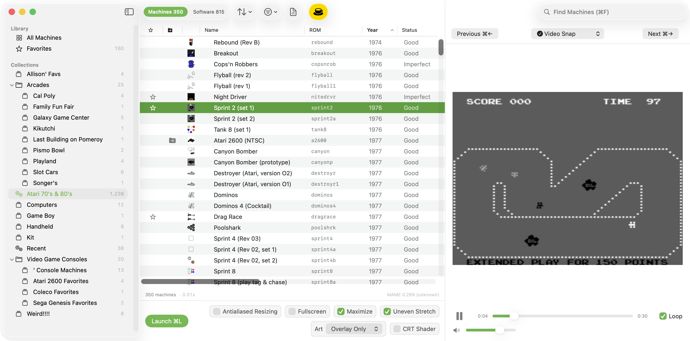
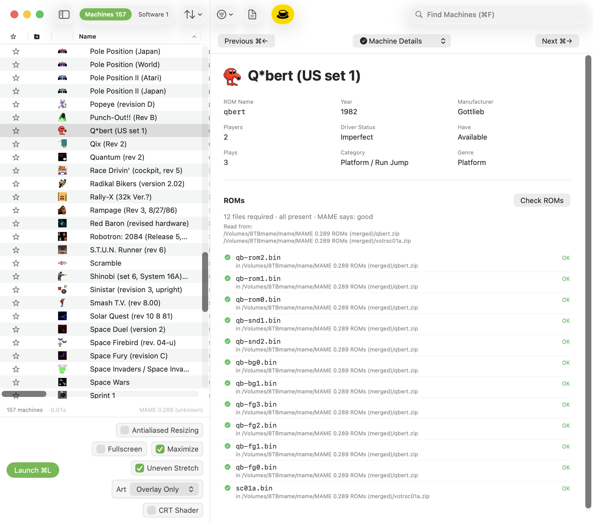
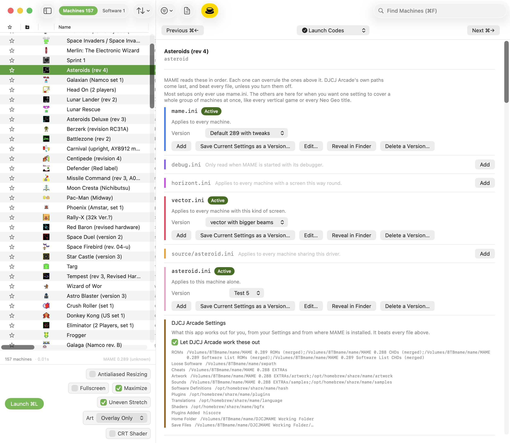
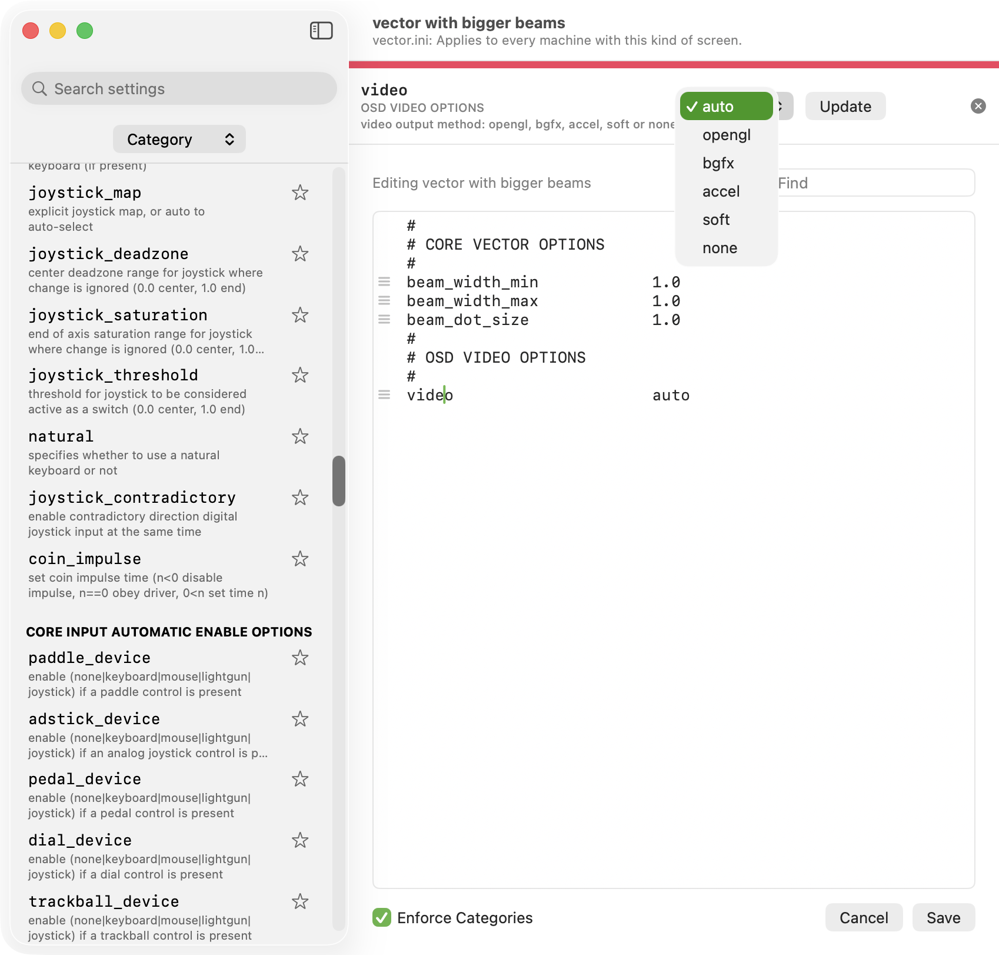

# DJCJ Arcade

A Mac app for browsing and playing your MAME collection.

## What this is

MAME can run just about every arcade machine, home computer, and game console ever
built. Roughly fifty thousand of them, plus another hundred and forty thousand games and
programs that ran on those machines. The catch is that MAME has no real front door.
Everything inside it is filed under short names like `sprint2`, `qbert`, and `a2600`, and
if you don't already know the name of the thing you want, you are not going to find it.

Picture a warehouse holding every arcade cabinet ever made, stacked to the ceiling, in the
dark, with nothing but a serial number stenciled on the side of each one. That is roughly
the situation. MAME was built to run the machines, not to help you work out which one you
feel like playing tonight.

DJCJ Arcade turns the lights on.

It reads the catalog out of your own copy of MAME, so what you see always matches the
version you actually have installed. You get real names, the year, the manufacturer, box
art, short video clips of the games running, and a clear answer to the question that
matters most: do I actually have the files to play this one? Then you click Launch.



## Browsing

The middle of the window is a list of machines. Sort it by name, year, manufacturer, or
whatever else you like, and stack a second sort underneath the first. Filter out the
things you don't care about, like clones, or machines MAME can't run properly yet.

Machines that are really a platform rather than a single game, an Atari 2600 or a Game
Boy for instance, can be opened up to show everything that ran on them. Click into the
Atari 2600 and you get its game library rather than one line in a list.

The search box finds things by name across the whole catalog.

## Collections

You can group machines and games into collections, and put collections inside folders.
Anything can go in as many collections as you like.

There are two kinds. A regular collection holds whatever you drag into it. A smart
collection describes what belongs in it and then fills itself in, so "everything Atari
made in the seventies and eighties" stays accurate on its own.

## Knowing what you actually own

The catalog lists everything MAME supports, which is not the same as everything you have.
DJCJ Arcade tracks the difference.

There is a Have column, and a filter to show only the things you can really play. You can
ask MAME to audit your whole collection, and for any single machine you can see exactly
which files it needs, which ones you have, where each one was found, and whether MAME
considers it good.



## The right hand pane

The panel on the right shows extra material for whatever is selected. Video clips of the
game in motion, scans of the original manual, box art, flyers, and the machine's own
details. Flip between them with the picker at the top, and set which ones you want and in
what order in Settings.

Most of that material comes from a separate media pack that the MAME community puts
together. It is not required and the app works without it. With it, you get the artwork
and video for most of the catalog.

## Launching

Select something and press Launch, or hit Command L.

Along the bottom of the window are the settings you actually change often: fullscreen,
whether to stretch the picture, artwork, and a CRT shader if you want the scanlines back.
Set them per launch without going near a settings file.

For machines with more than one drive, a computer with a hard disk and a couple of floppy
slots for instance, you can save a loadout: this disk in that drive, that disk in the
other one. Give it a name, save as many as you like, and the machine starts up ready to
go instead of making you load each piece of media by hand every time.

## Launch Codes

This one needs a little explaining.

MAME's settings work in layers. A general setting for everything, then one for every
machine with a vertical screen, then one for everything that shares a particular chipset,
then one for the single machine you are looking at. Each layer can overrule the ones
above it. The setting you are looking for might be in any one of them, and something
further down the stack might be canceling it out without saying so.

Launch Codes lays the whole stack out for whatever machine you have selected, in order,
color coded, showing you which layers are actually in play and which are sitting empty.
You can edit any of them, and save named versions of each one, so "vector with bigger
beams" is a thing you can switch on and off rather than a change you make and then forget
you made.



## The settings editor

Those layers are files, and you can edit them inside the app rather than opening them in
a text editor. MAME has hundreds of settings, and the file on its own tells you nothing
about any of them.

The editor lists every setting the copy of MAME you have installed actually understands,
each with a short description of what it does. Search them, browse them by category, or
star the ones you keep coming back to. It completes option names as you type, and when a
setting only accepts certain values it hands you the list instead of leaving you to
remember it. If you write something MAME will not recognize, it says so, and gives you
the likely reasons: a typo, a setting from a different version of MAME, or hardware you
do not have connected.



## What you need before this is useful

**MAME itself.** DJCJ Arcade doesn't include it and doesn't replace it. It reads MAME's
catalog and hands the actual work of running a machine over to MAME. The easiest way to
install it on a Mac is with [Homebrew](https://brew.sh):

```
brew install mame
```

**Your own ROMs.** None are included here, and none ever will be. The app will happily
show you the whole catalog with nothing installed, so you can browse fifty thousand
machines without owning a single file, but you can only play what you have.

**The EXTRAs pack, optionally.** This is the community assembled collection of artwork,
video clips, manuals, and categories. Everything works without it. Things look a lot
better with it.

**macOS 14 or later**, on either an Apple Silicon or an Intel Mac. The download is a
universal build, so it runs natively on both rather than going through Rosetta.

## Installing

Download the latest version from the [Releases](../../releases) page, open the disk
image, and drag DJCJ Arcade to your Applications folder.

The app is signed and notarized with Apple, so it will open normally. macOS will still
ask you to confirm the first time you run anything downloaded from the internet, which is
expected.

## Setting it up

The first time you open it, the catalog is empty. Choose Rebuild Catalog from the File
menu and it will ask MAME what it supports and build its own index. That takes about
twenty seconds.

After that, point it at your files in Settings: where your ROMs live, your CHDs, the
EXTRAs pack if you have it, and a working folder for MAME's own configuration. If your
ROM folders have the set version in the name, something like `MAME 0.289 ROMs (merged)`,
the app watches for newer folders sitting next to them and offers to switch when you
upgrade, rather than silently breaking.

## Licenses and credits

MAME is its own project, run by its own people, at
[mamedev.org](https://www.mamedev.org). This app is not affiliated with them. It reads
their catalog and asks their software to run things, and that is the whole of the
relationship.

The app includes some third party components. Details and their license terms are in
[third-party-licenses.md](third-party-licenses.md).

No ROMs are included with this app, and none are linked from here. What you choose to run
is between you and the law where you live.

## If you like it

This is free, and it is a hobby project. If you got some use out of it, you can
[buy me a coffee](https://www.buymeacoffee.com/chris.com).
